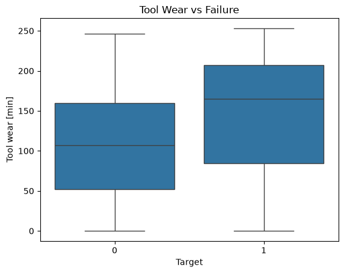
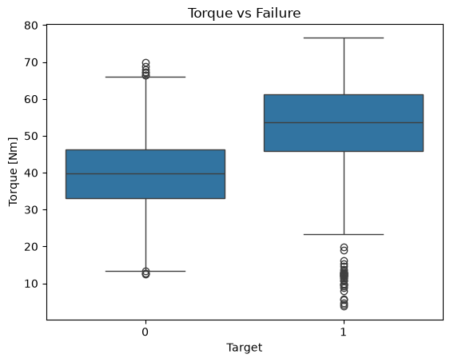
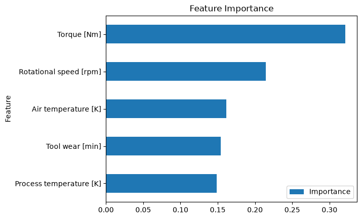
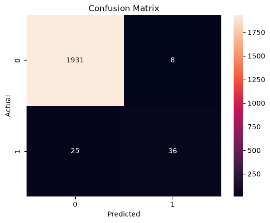

# Predictive Maintenance Analysis

## Overview

This project uses machine learning and industrial sensor data to predict machine failures before they occur.

The objective is to demonstrate a predictive maintenance workflow that could help manufacturers reduce unplanned downtime and optimize maintenance schedules.

## Dataset

The dataset contains 10,000 machine observations with operational measurements including:

- Air Temperature
- Process Temperature
- Rotational Speed
- Torque
- Tool Wear

Target Variable:

- 0 = No Failure
- 1 = Failure

## Tools Used

- Python
- Pandas
- Matplotlib
- Seaborn
- Scikit-Learn
- Jupyter Notebook

## Exploratory Analysis

Key findings:

- Torque showed the strongest correlation with machine failure (r = 0.191).
- Tool wear was the second strongest predictor (r = 0.105).
- Failed machines generally exhibited higher tool wear than non-failed machines.
- Rotational speed demonstrated low linear correlation but high importance within the Random Forest model, suggesting non-linear relationships.

### Tool Wear vs Failure

### Torque vs Failure

## Machine Learning Model

Model:
- Random Forest Classifier

Performance:

- Accuracy: 98%
- Precision: 82%
- Recall: 59%
- F1 Score: 0.69

### Feature Importance

### Confusion Matrix

## Business Impact

A predictive maintenance model can help maintenance teams identify at-risk equipment before failure occurs, reducing downtime and improving operational efficiency.

## Future Improvements

- Hyperparameter tuning
- Cross-validation
- Failure-type classification
- Real-time prediction pipeline
